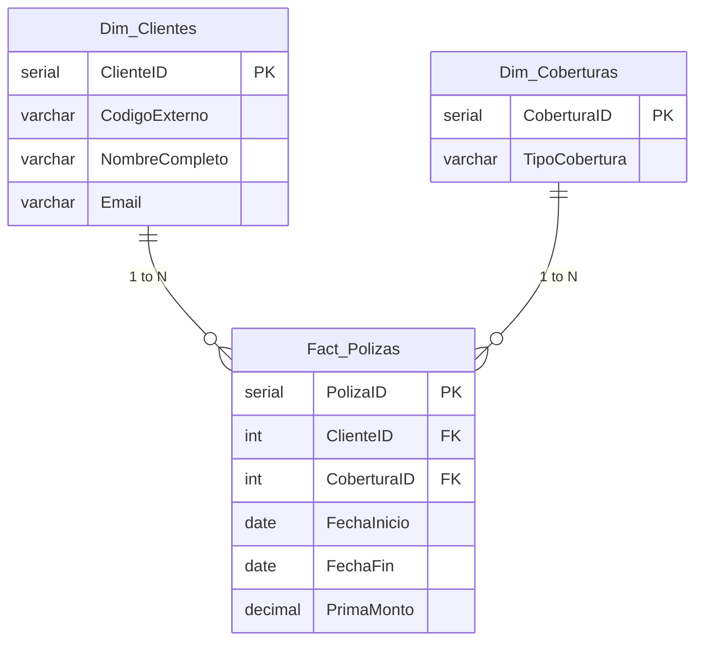

[English](README.md) | [Español](README.es.md) | [Português](README.pt.md)

<h1 align="center">
  🏢 Proyecto de Migración de Datos de Seguros
</h1>

  <i>Un proyecto End-to-End de Arquitectura SQL e Ingeniería de Datos para el Portfolio</i>

  
  
  

---

## 🎯 El Desafío
En el entorno analítico moderno, la calidad de los datos es una limitación crítica. Este proyecto aborda el problema común del mundo real de **migrar un sistema de seguros legado** poblado con datos "sucios" (fechas inconsistentes, cadenas de texto corruptas, duplicados y valores nulos) hacia un **Modelo en Estrella** limpio y optimizado para análisis actuarial e Inteligencia de Negocios (BI).

## 🏗️ Diseño de Arquitectura

*(Un modelo multidimensional optimizado diseñado para latencias bajas en reportes de BI)*

## 💡 Aspectos Técnicos Destacados

Este proyecto va más allá de operaciones INSERT simples, demostrando habilidades de **Ingeniería de Datos de nivel corporativo**:

- 🧹 **Scrubbing de Datos Robusto**: Manejo de datos crudos en entorno de "Staging" aplicando transformaciones en tiempo real (`NULLIF`, `CAST`, `REPLACE`, `TO_DATE`) para lidiar con strings corrompidos y formatos de fecha dinámicos.
- 🛡️ **Manejo de Errores (Logs de Auditoría)**: Un patrón de arquitectura para capturar registros descartados en una tabla `Log_Errores_Migracion` guardando el input en `JSONB`, garantizando 0% de pérdida financiera silenciosa.
- 🔄 **Carga de Datos Idempotente**: Uso de la cláusula `ON CONFLICT DO NOTHING` en la carga de Dimensiones para permitir flujos repetitivos, seguros y tolerantes a fallos sin generar registros duplicados.
- ⏱️ **Tuning y Estrategia de Índices**: Índices `B-Tree` sobre llaves foráneas (`ClienteID`) y rangos temporales (`FechaInicio`, `FechaFin`) para acelerar dramáticamente el BI.
- 🧮 **Lógica de Negocios sobre la marcha**: Aritmética de Intervalos (`Interval Arithmetic`) directa en SQL para calcular fechas de expiración de las pólizas durante el volcado de la tabla de Hechos.

## 🚀 Tecnologías Usadas
- **Motor de Base de Datos:** PostgreSQL
- **Lenguaje:** DDL (Data Definition Language) y DML (Data Manipulation Language) Avanzado.
- **Técnicas Base:** Uniones Múltiples (`JOIN`), Agregaciones Condicionales (`CASE WHEN`), Casts Dinámicos, y Manejo Estructurado de JSON.

## 💼 ¿Por qué es importante?
Las estrategias mostradas aquí reflejan los verdaderos obstáculos de los Equipos de Datos modernos:
1. Traducir caos del mundo real a arquitecturas relacionales limpias.
2. Contruir fundaciones estadísticas en las que los Científicos de Datos y Actuarios puedan confiar.
3. Escribir código seguro de ser automatizado en pipelines (ETL).

---

  <i>Desarrollado para mostrar nivel de expertise en Arquitectura Relacional y Procesos ETL con base analítica SQL.</i>

