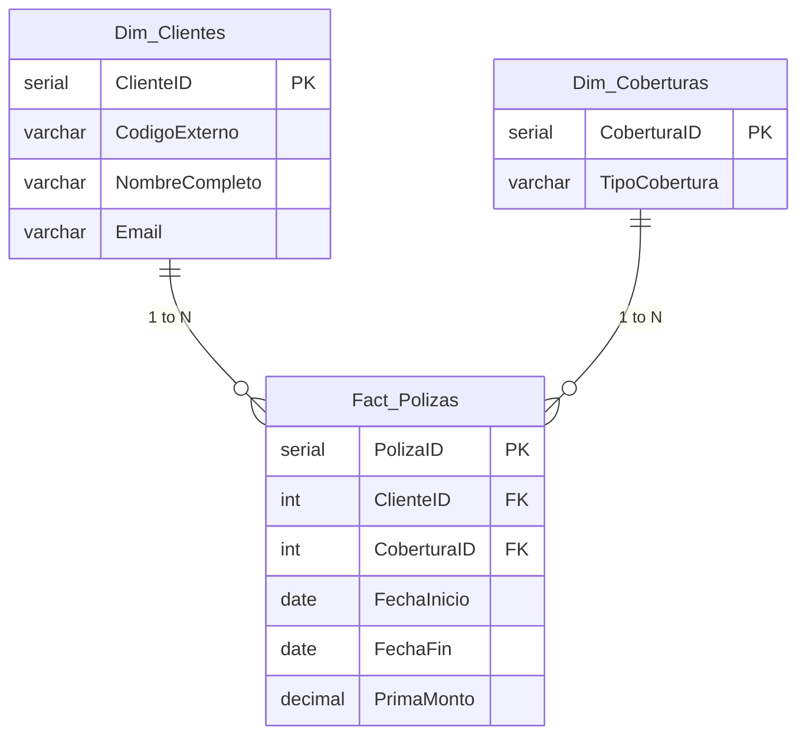

<h1 align="center">
  🏢 Insurance Data Migration Project
</h1>

  <i>An end-to-end SQL Architecture & Data Engineering Portfolio Project</i>

  
  
  

---

## 🎯 The Challenge 
In the modern analytics environment, data quality is a critical constraint. This project tackles the common real-world problem of **migrating a legacy insurance system** populated with "dirty" data (inconsistent dates, corrupt strings, duplicates, and missing values) into a clean, optimized **Star Schema** Data Warehouse designed for Business Intelligence and Actuarial analytics.

## 🏗️ Architecture Design

*(An optimized multidimensional model designed for low-latency BI querying)*

## 💡 Key Technical Highlights

This project stands out by moving beyond simple INSERT statements to demonstrate **Enterprise-grade Data Engineering skills**:

- 🧹 **Robust Data Scrubbing**: Staging raw flat data and applying real-time transformations (`NULLIF`, `CAST`, `REPLACE`, `TO_DATE`) to handle corrupt strings and dynamic date formats.
- 🛡️ **Graceful Error Handling (Audit Logs)**: A dedicated architecture pattern to capture dropped/failed records into a `Log_Errores_Migracion` table utilizing `JSONB` for raw data ingestion, ensuring 0% silent financial data loss.
- 🔄 **Idempotent Data Loading**: Utilizing `ON CONFLICT DO NOTHING` patterns inside dimension loads, enabling pipelines to be robust, repeatable, and failure-resistant.
- ⏱️ **Query Tuning & Indexing**: Created targeted `B-Tree` Indexes over foreign keys (`ClienteID`) and time-series boundaries (`FechaInicio`, `FechaFin`) to drastically minimize latency on heavy BI reporting queries.
- 🧮 **On-the-Fly Business Logic**: Implementation of **Interval Arithmetic** directly inside SQL to calculate Policy expiration dates dynamically during the Fact Load workflow.

## 🚀 Built With
- **Database Engine:** PostgreSQL
- **Query Language:** Advanced Data Definition Language (DDL) and Data Manipulation Language (DML).
- **Core Techniques:** Multi-table `JOIN` patterns, Conditional Aggregations (`CASE WHEN`), Dynamic Casting, and JSON Handling.

## 💼 Why this matters?
The strategies employed in this repository mirror the actual hurdles faced by Modern Data Teams:
1. Translating messy real-world scenarios into structured relational models.
2. Building analytical foundations that Actuaries and Data Scientists can trust.
3. Writing code that is safe to deploy in repeating scheduled automated pipelines.

---

  <i>Developed to showcase mastery in Relational Design and SQL-based ETL Processing.</i>

