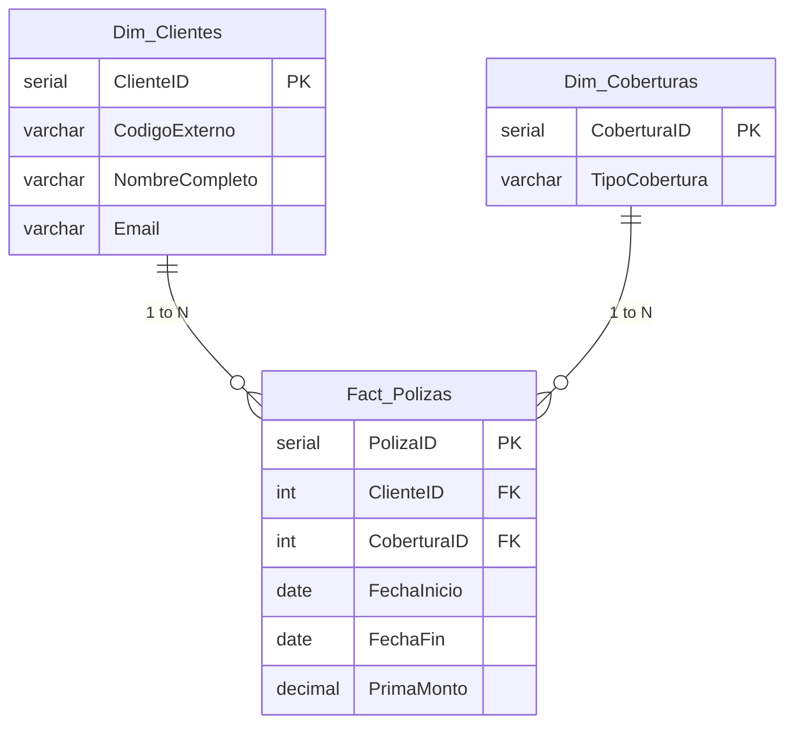

[English](README.md) | [Español](README.es.md) | [Português](README.pt.md)

<h1 align="center">
  🏢 Projeto de Migração de Dados de Seguros
</h1>

  <i>Um projeto End-to-End de Arquitetura SQL e Engenharia de Dados para o Portfólio</i>

  
  
  

---

## 🎯 O Desafio
No ambiente analítico moderno, a qualidade dos dados é uma restrição crítica. Este projeto resolve o problema comum do mundo real de **migrar um sistema de seguros legado** preenchido com dados "sujos" (datas inconsistentes, strings corrompidas, duplicatas e valores ausentes) para um **Star Schema** (Modelo Estrela) Data Warehouse limpo e otimizado, projetado para Business Intelligence e análise atuarial.

## 🏗️ Design da Arquitetura

*(Um modelo multidimensional otimizado para consultas de BI de baixa latência)*

## 💡 Destaques Técnicos

Este projeto vai além de simples comandos INSERT para demonstrar **habilidades de Engenharia de Dados de nível corporativo**:

- 🧹 **Scrubbing Robusto de Dados**: Staging de dados brutos e aplicação de transformações em tempo real (`NULLIF`, `CAST`, `REPLACE`, `TO_DATE`) para manipular strings corrompidas e formatos de dados dinâmicos.
- 🛡️ **O Tratamento Elegante de Erros (Logs de Auditoria)**: Um padrão de arquitetura dedicado para capturar registros descartados/falhos em uma tabela `Log_Errores_Migracion` utilizando `JSONB` para ingestão de dados brutos, garantindo perda financeira zero.
- 🔄 **Carregamento Idempotente de Dados**: Implementando a lógica de `ON CONFLICT DO NOTHING` em loads dimensionais, permitindo que os pipelines sejam robustos, repetíveis e tolerantes a falhas.
- ⏱️ **Otimização e Indexação de Consultas**: Índices `B-Tree` focados para chaves estrangeiras (`ClienteID`) e tempos (`FechaInicio`, `FechaFin`) com o objetivo de reduzir drasticamente a latência dos relatórios analíticos de BI.
- 🧮 **Lógica de Negócios Dinâmica**: Aritmética de Intervados (*Interval Arithmetic*) implementada nativamente em SQL. Traz o cálculo do tempo de expiração da apólice instantaneamente durante o processo ETL.

## 🚀 Feito Com
- **Mecanismo de Banco de Dados:** PostgreSQL
- **Linguagem de Consulta:** DDL Avançado e DML Moderno.
- **Técnicas Base:** Casos de uso de múltiplos `JOIN`, Agregações Condicionais (`CASE WHEN`), Conversão Dinâmica, e tratamento JSON Avançado no PostgreSQL.

## 💼 Por que isso importa?
As metodologias aplicadas neste projeto refletem os desafios reais enfrentados pelas modernas equipes de Dados:
1. Traduzir cenários caóticos do mundo real em modelos bem estabelecidos de forma estrutural.
2. Formar bases nas quais os Analistas de BI e Atuários possam confiar.
3. Criar rotinas programadas confiáveis com um alto índice de tolerância a erros.

---

  <i>Desenvolvido para mostrar maestria na Arquitetura Relacional e pipelines analíticos ETL com SQL.</i>

